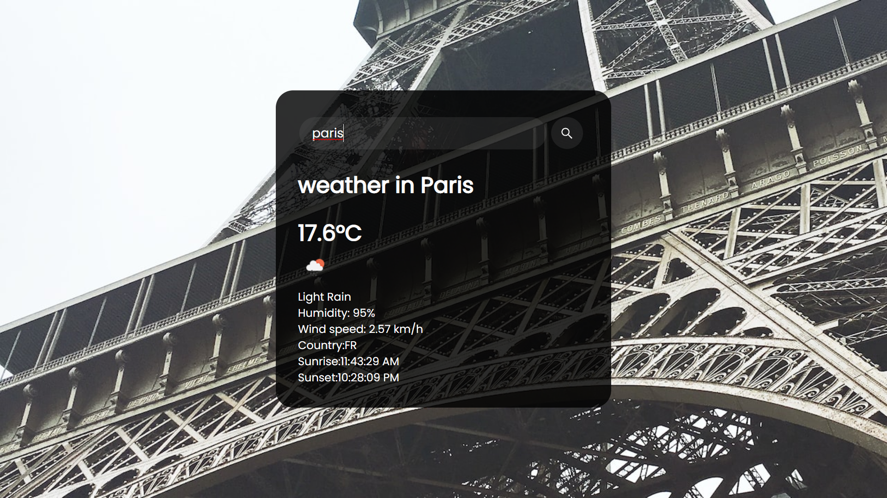

# **This is Weather app by Sanjiv Paul**

### _`Author: Sanjiv Paul`_
*This is mini project 02 of edureka full stack Web Development Course* 
## This is weather app made with using `HTML`, `CSS` & `JavaScript`.
#### Note: This weather app is uploading on github pages so some functionalities are not working you can download this code on your local machine this will work perfectly

## 
